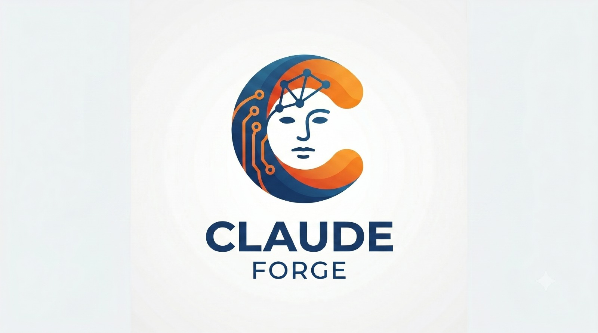

# Claude Forge

<p align="center">
  
</p>

<p align="center">
  <a href="https://github.com/ArieGoldkin/claude-forge/actions/workflows/ci.yml"></a>
  <a href="LICENSE"></a>
  
</p>

> A suite of domain-agnostic Claude Code plugins sharing hook infrastructure via directory-level symlinks.

Monorepo for the **Claude Forge** plugin suite (ctk, dtk, atk, ftk, etk) with shared hook infrastructure.

## Plugins

Five independent plugins — install only the ones you need. Each is domain-agnostic and works on any project. Install **ctk** alongside any of the others to get the shared safety and continuity layer (security guardrails, auto-permissions, session persistence) they all build on.

| Plugin | Version | Skills · Agents · Commands | What it is and what you get |
|--------|---------|:--------------------------:|------------------------------|
| **[ctk](plugins/continuity-toolkit/)** — Continuity Toolkit | 2.7.2 | 11 · 1 · 12 | **Your sessions stop forgetting.** State survives compaction and restarts through an auto-saved handoff (PreCompact → SessionStart), with context-window monitoring, delta-cache token compression, and a save/resume ledger. Also ships the suite's shared safety layer — a dangerous-bash registry (filesystem/http/aws/terraform), an approval-first git-push gate, and the 32 shared hooks the other plugins rely on. |
| **[dtk](plugins/devops-toolkit/)** — DevOps Toolkit | 2.0.10 | 15 · 2 · 12 | **Stop rebuilding infrastructure from scratch.** Production-ready AWS, Terraform, and CI/CD recipes — Lambda container deploys, VPC/networking, cost optimization, and observability — plus Salesforce integration and one-command Husky pre-commit setup. |
| **[atk](plugins/ai-toolkit/)** — AI Toolkit | 2.0.8 | 16 · 1 · 25 | **Ship LLM features without rediscovering the same patterns.** RAG pipelines, embeddings and vector search, LangGraph workflows, and function calling, plus evaluation, streaming, and testing harnesses, prompt caching, and NotebookLM — OpenAI and Anthropic patterns side by side. |
| **[ftk](plugins/frontend-toolkit/)** — Frontend Toolkit | 2.3.10 | 17 · 4 · 11 | **Close the design-to-code gap.** React and shadcn/ui components, Figma and Google Stitch AI import, json-render generative UI, design-system tokens, headless browser automation, and Remotion explainer videos — prototype to production. |
| **[etk](plugins/engineering-toolkit/)** — Engineering Toolkit | 2.10.0 | 26 · 4 · 20 | **Catch problems before review, not after push.** TDD and quality gates, structured code/MR review across GitLab and GitHub with inline comments, ADRs, Sentry investigation, goal-driven auto-research, brainstorming, and codebase zoom-out — your engineering-discipline layer. |

> Counts are **skills · agents · commands** per plugin.

## Installation

### Via Marketplace (Recommended)

```bash
# Add the marketplace
/plugin marketplace add https://github.com/ArieGoldkin/claude-forge.git

# Install individual plugins
/plugin install ctk@claude-forge
/plugin install etk@claude-forge
```

### Via git-subdir (Direct Install)

Install individual plugins directly from the monorepo without adding a marketplace:

```bash
/plugin install --source git-subdir \
  --url https://github.com/ArieGoldkin/claude-forge.git \
  --path plugins/continuity-toolkit
```

### Local Development

```bash
git clone git@github.com:ArieGoldkin/claude-forge.git
claude --plugin-dir ./claude-forge/plugins/continuity-toolkit
```

> **Tip**: Use `/reload-plugins` to hot-reload plugin changes without restarting Claude Code.

## Architecture

Shared hook infrastructure (lib utilities, types) lives in `shared/hooks-infra/` and is symlinked into each plugin's `hooks/src/` directory. Each plugin maintains its own hook implementations, build configs, and versioning.

```
claude-forge/
├── shared/hooks-infra/     # Shared lib (12 files) + types.ts
│   ├── src/lib/            # output, input, logging, path-utils, guards, etc.
│   ├── src/types.ts        # Core type definitions
│   └── tests/lib/          # Shared lib unit tests
├── plugins/
│   ├── continuity-toolkit/    # hooks/src/lib → symlink to shared
│   ├── devops-toolkit/        # hooks/src/lib → symlink to shared
│   ├── ai-toolkit/            # hooks/src/lib → symlink to shared
│   ├── frontend-toolkit/      # hooks/src/lib → symlink to shared
│   └── engineering-toolkit/   # hooks/src/lib → symlink to shared
└── .github/workflows/     # GitHub Actions CI (per-plugin matrix)
```

> **Note**: Install `ctk` alongside other plugins for shared hook coverage (security, permissions, lifecycle). All 5 plugins are domain-agnostic and reusable on any project. See [CLAUDE.md](CLAUDE.md) for full architecture details.

## Development

```bash
# Edit shared code — all plugins pick it up instantly
vim shared/hooks-infra/src/lib/output.ts

# Test in any plugin
cd plugins/continuity-toolkit/hooks && npm test

# Plugin-specific changes
cd plugins/continuity-toolkit/hooks && vim src/pretool/security-blocker.ts

# Hot-reload after changes (no restart needed)
/reload-plugins
```

## Repository

https://github.com/ArieGoldkin/claude-forge
